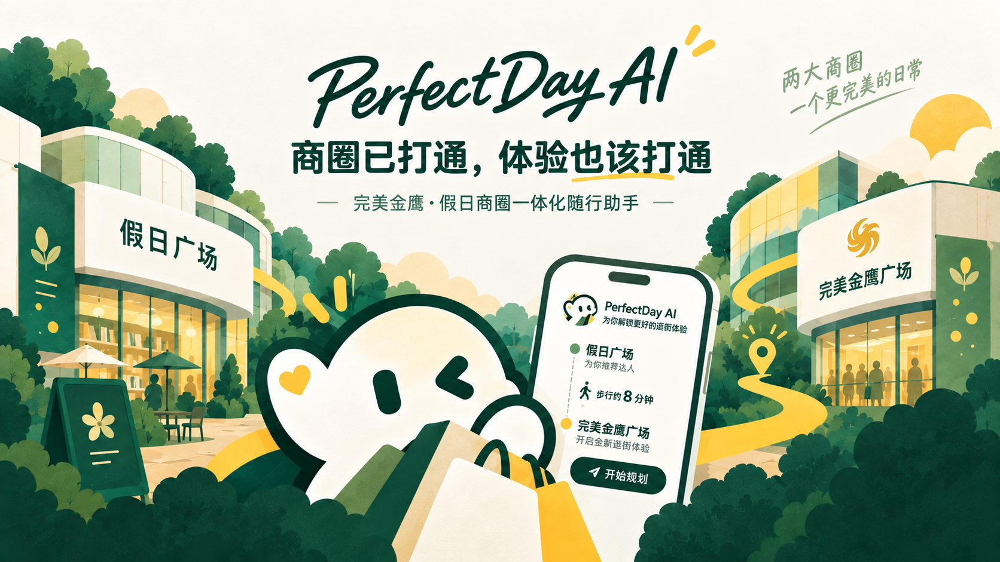
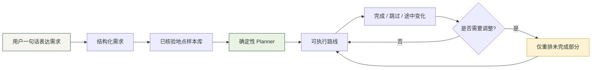
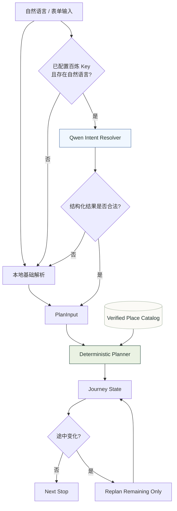
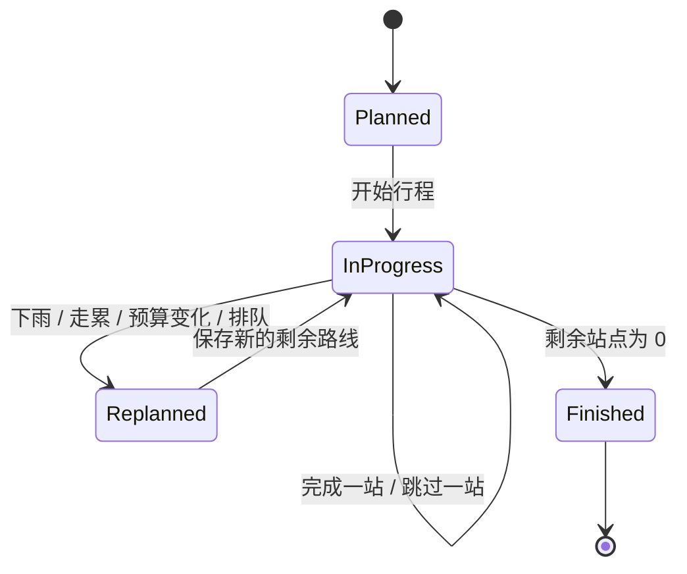
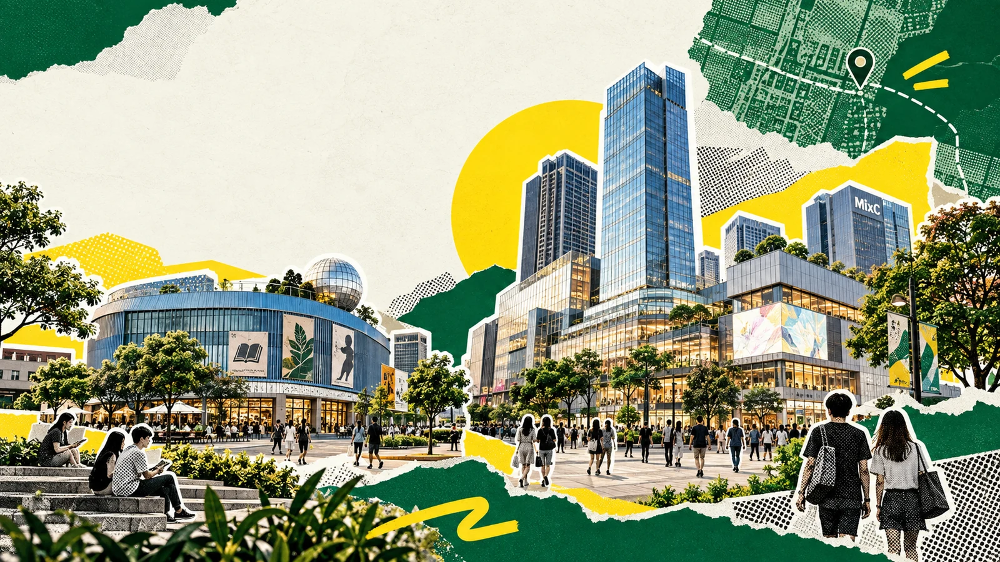
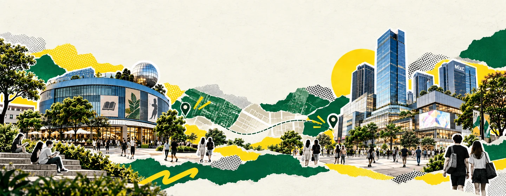
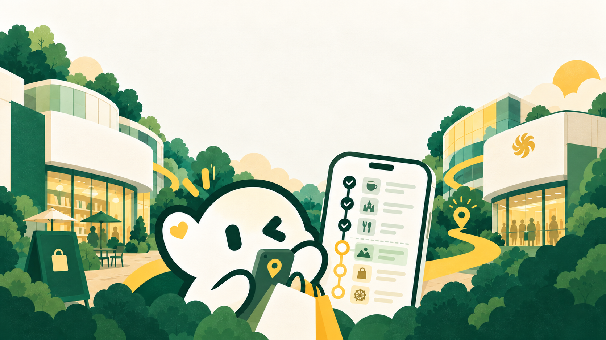
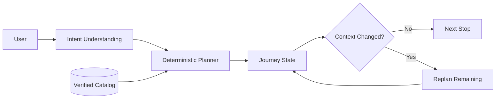

<div align="center">

# PerfectDay AI

### 完美金鹰·假日商圈一体化随行助手

**商圈已经打通，PerfectDay AI 让体验也真正打通。**

[](https://perfectday-ai.vercel.app)
[](https://nextjs.org/)
[](https://react.dev/)
[](https://www.typescriptlang.org/)
[](https://perfectday-ai.vercel.app)
[](https://github.com/liqinglq666/perfectday-ai/actions/workflows/ci.yml)

**[中文](#zh-cn) · [English](#english) · [日本語](#日本語)**

<a href="https://perfectday-ai.vercel.app">
  
</a>

<sub>↑ 点击主视觉直接进入线上应用 / Click the hero to open the live app</sub>

</div>

---

<a id="zh-cn"></a>

## 中文

PerfectDay AI 是一个 **移动端优先的商圈行程规划 PWA**，聚焦中山完美金鹰·假日商圈。它不把商圈拆成两份静态攻略，而是把已经物理连通、业态互补的一片区域组织成一段可以持续维护的真实行程。

用户只需要描述同行人、时间、预算、步行偏好与想去/不想去的地点，系统会把阅读、咖啡、餐饮、购物、亲子与生活方式内容组合成路线；途中遇到 **下雨、走累、预算变化、餐厅排队或时间缩短** 时，只重排尚未发生的部分，已完成的地点保持不动。

> **AI 负责听懂你，确定性规划器负责把事情做对，Journey 状态引擎负责变化后继续走。**

### 产品闭环



### AI 调用架构

PerfectDay AI 采用 **LLM Intent Understanding + Deterministic Planning** 的混合架构。Qwen 不直接生成路线，也不负责商户事实；模型只把自然语言解析为可验证的结构化约束。



模型输出会先经过白名单和字段校验，再进入规划器。例如：

```json
{
  "scene": "friends",
  "duration": 240,
  "budget": "300",
  "walking": "low",
  "preferredPlaceIds": ["boya-bookstore"],
  "excludedPlaceIds": ["daka-coffee"],
  "indoorOnly": false
}
```

如果模型未配置、超时、返回异常、调用失败或触发应用侧限流，系统会自动回退到本地规则解析，因此 **路线生成和途中重排并不依赖模型持续在线**。

### Journey 状态机



### 核心能力

| 能力 | 实现方式 | 设计原则 |
| --- | --- | --- |
| 自然语言理解 | 百炼 Qwen + 本地 fallback | AI 只做意图解析 |
| 路线生成 | 本地点库 + Deterministic Planner | 时间、预算、地点均可控 |
| 途中重排 | Journey + `replanRemaining()` | 只调整未来，不重写过去 |
| 地点真实性 | Verified Place Catalog | 模型不能编造商户 |
| 状态持久化 | URL Snapshot + Local Storage | 刷新、分享后仍可继续 |
| 地图跳转 | 高德 URI | 不引入不必要的地图 SDK |
| 安装体验 | PWA Manifest | Mobile First |

### 页面体验

<table>
  <tr>
    <td width="50%">
      <a href="https://perfectday-ai.vercel.app">
        
      </a>
      <br />
      <sub><b>Home</b> · 一句话生成今天的路线</sub>
    </td>
    <td width="50%">
      <a href="https://perfectday-ai.vercel.app/guide">
        
      </a>
      <br />
      <sub><b>Guide</b> · 一体化商圈资料与地点来源</sub>
    </td>
  </tr>
  <tr>
    <td width="50%">
      <a href="https://perfectday-ai.vercel.app">
        
      </a>
      <br />
      <sub><b>AI Planning</b> · 自然语言 → 结构化约束 → 路线</sub>
    </td>
    <td width="50%">
      <a href="https://perfectday-ai.vercel.app">
        
      </a>
      <br />
      <sub><b>Live Replanning</b> · 计划有变，只重排还没发生的部分</sub>
    </td>
  </tr>
</table>

### 工程结构

```text
app/
├─ actions.ts                 # Server Action：生成行程
├─ components/
│  ├─ home/                   # 首页规划与安装体验
│  ├─ trip/                   # 行程、进度、时间线、分享
│  ├─ adjust/                 # 剩余路线调整与预览
│  ├─ guide/                  # 地点目录
│  ├─ header.tsx              # 全局导航
│  └─ ui-icon.tsx             # 轻量 SVG 图标
├─ trip/                      # /trip
├─ adjust/                    # /adjust
└─ guide/                     # /guide

config/
└─ site.ts                    # 品牌、路由、地图、素材统一配置

data/                         # 已核验地点 / 关闭地点
lib/                          # planner / journey / AI / storage / utilities
types/                        # 领域模型
public/                       # 正式视觉资产与 PWA 图标
tests/                        # 回归测试
scripts/                      # 页面级流程验证
```

### 技术栈

| Layer | Technology |
| --- | --- |
| Framework | Next.js 16 · App Router |
| UI | React 19 · TypeScript · Pure CSS |
| AI | Alibaba Cloud Bailian · `qwen-plus` |
| Planning | Local deterministic TypeScript planner |
| State | URL snapshot · Local Storage · Session Storage |
| Maps | AMap URI |
| Deployment | Vercel |
| Quality | Node Test Runner · TypeScript · Production Build · Flow Verification |

### 本地运行

```bash
npm ci
npm run dev
```

打开 `http://localhost:3000`。

完整质量检查：

```bash
npm run check
```

等价于：

```bash
npm test
npm run typecheck
npm run build
npm run test:flow
```

### 环境变量

至少需要：

```bash
DASHSCOPE_API_KEY=your_key
```

可选：

```bash
DASHSCOPE_BASE_URL=https://dashscope.aliyuncs.com/compatible-mode/v1
DASHSCOPE_MODEL=qwen-plus
```

未配置 Key 时，应用仍然可以使用本地解析和确定性规划。

百炼配置见 [`docs/BAILIAN_SETUP.md`](docs/BAILIAN_SETUP.md)。

### 数据可信边界

地点来自项目维护的代表性地点样本库，AI **不能自行编造商户、地址、价格或实时状态**。消费、停留与步行均为规划估算；营业时间、票价、实时排队、车位和精确无障碍通道未接入，现场情况以实际导视与商户信息为准。

多个连通口已启用，但项目不会把“已连通”进一步推断为“所有路径全程遮雨、无台阶或所有室内动线均已核实”。

- [`docs/DATA_SOURCES.md`](docs/DATA_SOURCES.md) — 数据来源
- [`docs/PLACE_VERIFICATION.md`](docs/PLACE_VERIFICATION.md) — 地点核验记录
- [`docs/BAILIAN_SETUP.md`](docs/BAILIAN_SETUP.md) — 百炼配置

---

<a id="english"></a>

## English

**PerfectDay AI** is a mobile-first PWA for planning and maintaining a real-world shopping-district journey across the connected Perfect Golden Eagle · Holiday Plaza area in Zhongshan, China.

Instead of asking an LLM to hallucinate an itinerary, PerfectDay separates responsibilities:

- **Qwen understands intent** — companions, time, budget, walking preference, preferred and excluded places.
- **A deterministic planner builds the route** — using a verified local place catalog.
- **Journey state preserves reality** — completed stops stay completed.
- **Replanning only changes the future** — rain, fatigue, queueing, budget or time changes never rewrite past progress.

**Live:** [perfectday-ai.vercel.app](https://perfectday-ai.vercel.app)



---

<a id="日本語"></a>

## 日本語

**PerfectDay AI** は、中山市の完美金鹰・假日商圈を対象とした、モバイルファーストの行程プランニング PWA です。

LLM にすべてを任せるのではなく、役割を明確に分離しています。

- **Qwen**：自然言語から意図を構造化
- **Deterministic Planner**：検証済みスポットから実行可能なルートを生成
- **Journey State**：完了済みの行程を保持
- **Remaining-route Replanner**：雨、疲労、予算、待ち時間などの変化に対して未完了部分だけを再計画

**Live:** [perfectday-ai.vercel.app](https://perfectday-ai.vercel.app)

---

<div align="center">

### PerfectDay AI

**Plan what matters. Keep what already happened. Replan only what comes next.**

[Open the live app →](https://perfectday-ai.vercel.app)

</div>
