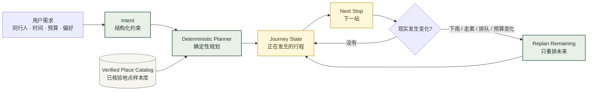
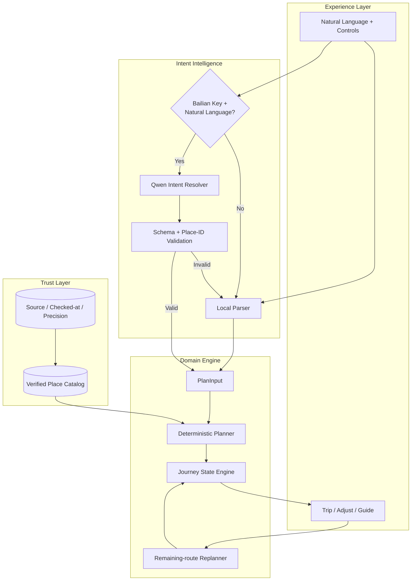
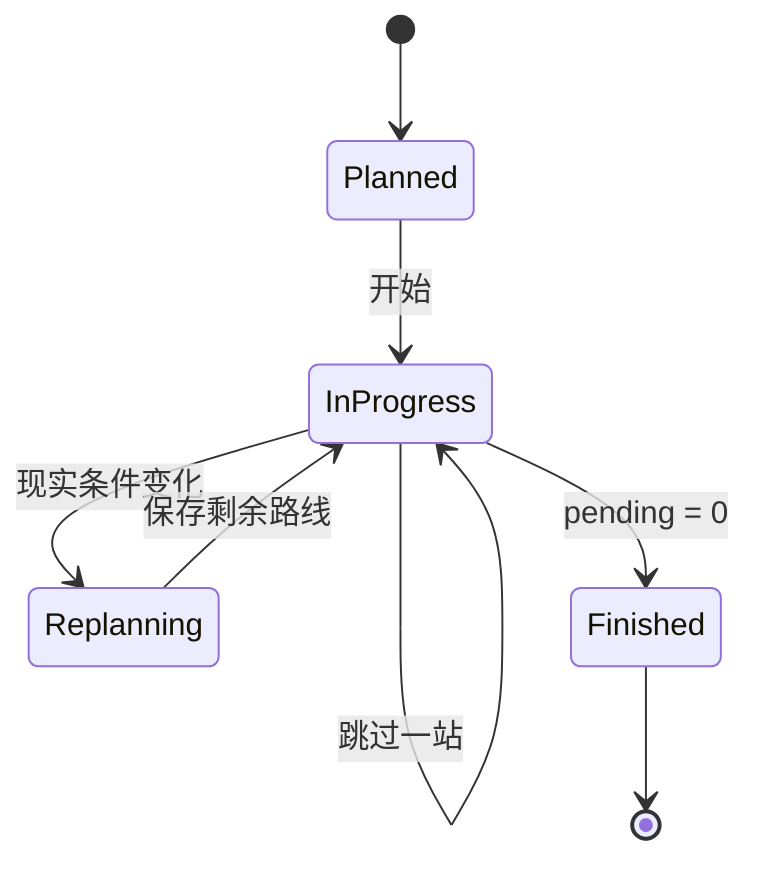

<div align="center">

<a href="https://perfectday-ai.vercel.app">
  
</a>

# PerfectDay AI

### 完美金鹰 · 假日商圈一体化随行助手

**把物理连通，变成真正连续的体验。**  
<sub>A stateful AI companion for planning — and maintaining — a real-world shopping-district journey.</sub>

<p>
  <a href="https://perfectday-ai.vercel.app"></a>
</p>

<p>
  
  
  
  
  
  
</p>

**[中文](#中文) · [English](#english) · [日本語](#日本語)**

<a href="https://perfectday-ai.vercel.app">
  
</a>

<sub>↑ 点击主视觉进入线上产品 · Click the hero to launch PerfectDay AI</sub>

</div>

---

<a id="中文"></a>

## 产品定义

**PerfectDay AI 不是一份静态商圈攻略，也不是让大模型自由生成路线。**  
它是一套面向真实逛街过程的 **AI 意图理解 + 确定性路线规划 + 状态化途中重排** 系统。

用户可以用一句话表达同行人、时间、预算、步行偏好和想去 / 不想去的地点。系统把这些需求映射到已核验地点样本库，生成一条可执行路线；当途中出现下雨、走累、预算变化、餐厅排队或时间缩短时，**已经发生的行程保持不动，只重排未来。**

> ### 核心设计原则
> **AI 负责听懂人，Planner 负责约束现实，Journey 负责记住已经发生的事。**

<table>
  <tr>
    <td width="25%"><b>01 · Understand</b><br/><sub>自然语言 → 结构化意图</sub></td>
    <td width="25%"><b>02 · Plan</b><br/><sub>真实地点 + 时间预算约束</sub></td>
    <td width="25%"><b>03 · Execute</b><br/><sub>下一站 / 完成 / 跳过 / 地图</sub></td>
    <td width="25%"><b>04 · Adapt</b><br/><sub>变化后仅重排未完成部分</sub></td>
  </tr>
</table>

---

## Product Loop · 产品闭环



### 为什么不是“LLM 直接生成路线”？

| 问题 | 纯 LLM 路线生成 | PerfectDay AI |
| --- | --- | --- |
| 商户真实性 | 可能产生不存在或过时地点 | 仅允许已核验地点 ID |
| 时间 / 预算 | 容易出现口头合理、数值失控 | Planner 统一计算 |
| 已完成行程 | 重新生成时容易被重写 | Journey 将过去锁定 |
| 途中变化 | 常常整条路线重做 | 仅重排 pending 部分 |
| AI 不可用 | 核心能力中断 | 自动 fallback 到本地规则 |
| 可测试性 | 输出不稳定 | 规划器 / 状态机可回归测试 |

---

## Intelligence Architecture · 智能调用架构

PerfectDay AI 使用 **LLM as Interpreter, not Authority** 的设计：Qwen 只负责把自然语言翻译成可以被程序验证的意图，不直接决定地点事实、价格与最终路线。



模型解析结果类似：

```json
{
  "scene": "friends",
  "duration": 240,
  "budget": "300",
  "walking": "low",
  "preferredPlaceIds": ["boya-bookstore"],
  "excludedPlaceIds": ["daka-coffee"],
  "indoorOnly": false
}
```

进入 Planner 之前，地点 ID、场景、时长、预算和字段类型都会被校验。模型超时、调用失败、格式异常、未配置 Key 或触发应用侧限制时，会回退到本地规则解析。

**因此：AI 提升理解能力，但不成为系统唯一的运行依赖。**

---

## Stateful Journey · 状态不是附加功能，而是产品核心

传统路线推荐把一次请求当成一次回答；PerfectDay 把一次逛街看成一个持续变化的状态过程。



`done`、`pending`、`skipped`、剩余时间与剩余预算共同构成 Journey 快照。重排只处理 `pending`，这是“**不重写过去**”能够真正落到代码层面的原因。

---

## Product Experience · 产品界面

<div align="center">

<table>
  <tr>
    <td width="50%" valign="top">
      <a href="https://perfectday-ai.vercel.app">
        
      </a>
      <p><b>01 · Plan</b><br/><sub>自然语言 + 时间 / 预算 / 步行偏好 → 今日路线</sub></p>
    </td>
    <td width="50%" valign="top">
      <a href="https://perfectday-ai.vercel.app/guide">
        
      </a>
      <p><b>02 · Explore</b><br/><sub>商圈理解、地点目录、公开来源与到店提醒</sub></p>
    </td>
  </tr>
  <tr>
    <td width="50%" valign="top">
      <a href="https://perfectday-ai.vercel.app">
        
      </a>
      <p><b>03 · Execute</b><br/><sub>下一站、地图、完成 / 跳过与剩余资源持续更新</sub></p>
    </td>
    <td width="50%" valign="top">
      <a href="https://perfectday-ai.vercel.app">
        
      </a>
      <p><b>04 · Replan</b><br/><sub>计划有变，不从头开始：只调整还没发生的部分</sub></p>
    </td>
  </tr>
</table>

</div>

---

## Engineering Contract · 工程约束

PerfectDay 的“专业”不是靠把功能堆复杂，而是把每一层的责任限定清楚。

| Layer | Responsibility | Guarantee |
| --- | --- | --- |
| **UI / Experience** | 收集需求、展示下一站和状态 | 不承担业务计算 |
| **Intent** | 把自然语言解析为结构化约束 | 可 fallback、可校验 |
| **Planner** | 决定地点组合、顺序、预算和时间 | 确定性、可测试 |
| **Journey** | 维护 done / pending / skipped | 已发生部分不可被重排覆盖 |
| **Data** | 提供地点事实与来源信息 | LLM 无权创建地点 |
| **Storage** | 最近行程、撤销、可分享 URL | Storage 失败不影响核心路线 |
| **CI** | test / typecheck / build / flow | PR 前验证关键路径 |

### Quality Gate

```bash
npm run check
```

统一执行：

```text
Regression Tests
      ↓
TypeScript Typecheck
      ↓
Production Build
      ↓
Rendered Journey Flow Verification
```

项目还包含针对 Planner、Journey、AI fallback、限流、关闭地点、Trip Storage 与静态素材引用的回归测试。

---

## Codebase · 工程目录

```text
perfectday-ai/
│
├─ app/
│  ├─ actions.ts                     # Server Action：行程生成入口
│  ├─ components/
│  │  ├─ home/                       # 首页需求输入
│  │  ├─ trip/                       # 行程、时间线、进度、分享
│  │  ├─ adjust/                     # 剩余行程重排
│  │  ├─ guide/                      # 地点浏览与筛选
│  │  ├─ header.tsx                  # 全局导航
│  │  └─ ui-icon.tsx                 # 轻量图标系统
│  ├─ trip/                          # /trip
│  ├─ adjust/                        # /adjust
│  └─ guide/                         # /guide
│
├─ config/
│  └─ site.ts                        # 品牌 / 路由 / 地图 / 素材配置
│
├─ data/                             # Verified Place Catalog
├─ lib/                              # Planner / Journey / AI / Storage / Utilities
├─ types/                            # Domain Types
├─ tests/                            # Regression Tests
├─ scripts/                          # End-to-end Flow Verification
├─ public/                           # Product Visuals + PWA Assets
└─ docs/                             # Setup + Data Sources + Verification
```

### Technology

<table>
  <tr><td><b>Application</b></td><td>Next.js 16 · React 19 · App Router</td></tr>
  <tr><td><b>Language</b></td><td>TypeScript</td></tr>
  <tr><td><b>AI</b></td><td>Alibaba Cloud Bailian · Qwen</td></tr>
  <tr><td><b>Planning</b></td><td>Deterministic local domain engine</td></tr>
  <tr><td><b>State</b></td><td>Journey snapshot · URL · Local Storage · Session Storage</td></tr>
  <tr><td><b>Map Handoff</b></td><td>AMap URI</td></tr>
  <tr><td><b>UI</b></td><td>Responsive custom CSS · Mobile-first PWA</td></tr>
  <tr><td><b>Deployment</b></td><td>Vercel</td></tr>
  <tr><td><b>Quality</b></td><td>Node Test Runner · Typecheck · Build · Flow Verification</td></tr>
</table>

---

## Trust & Data Boundary · 数据可信边界

PerfectDay 使用维护过的代表性地点样本库。系统明确区分 **已知事实、规划估算与实时未知信息**：

- AI 不能自行创建商户、地址、价格或实时营业状态。
- 地点保留来源、查阅时间与位置精度信息。
- 消费、停留和步行时间属于规划估算，不伪装成实时数据。
- 营业时间、票价、排队、车位与精确无障碍路径未接入时，会明确保留边界。
- “商圈已连通”不会被进一步推断成“所有路径全程遮雨 / 无台阶 / 室内动线均已核实”。

相关文档：[`DATA_SOURCES.md`](docs/DATA_SOURCES.md) · [`PLACE_VERIFICATION.md`](docs/PLACE_VERIFICATION.md) · [`BAILIAN_SETUP.md`](docs/BAILIAN_SETUP.md)

---

## Quick Start

```bash
git clone https://github.com/liqinglq666/perfectday-ai.git
cd perfectday-ai
npm ci
npm run dev
```

然后访问：

```text
http://localhost:3000
```

### Environment

```bash
DASHSCOPE_API_KEY=your_key
```

可选：

```bash
DASHSCOPE_BASE_URL=https://dashscope.aliyuncs.com/compatible-mode/v1
DASHSCOPE_MODEL=qwen-plus
```

没有配置 `DASHSCOPE_API_KEY` 时，产品仍可以通过本地解析与确定性 Planner 运行。

<details>
<summary><b>开发者命令 / Developer Commands</b></summary>

```bash
npm run dev        # development
npm test           # regression tests
npm run typecheck  # TypeScript check
npm run build      # production build
npm run test:flow  # rendered journey flow
npm run check      # full quality gate
```

</details>

---

<a id="english"></a>

<details open>
<summary><h2>English Overview</h2></summary>

**PerfectDay AI** is a stateful, mobile-first shopping-district companion for the connected Perfect Golden Eagle · Holiday Plaza area in Zhongshan, China.

Its architecture deliberately separates **language understanding** from **world-state execution**:

- **Qwen interprets intent**, but does not invent the itinerary.
- A **verified local catalog** defines what places may exist in the planning space.
- A **deterministic planner** owns time, budget, walking and route constraints.
- A **Journey state engine** preserves completed actions.
- A **remaining-route replanner** adapts only the future when reality changes.

The result is an AI product that remains useful when the model is unavailable, keeps real-world constraints testable, and avoids rewriting a user's already-completed journey.

**Live Product → [perfectday-ai.vercel.app](https://perfectday-ai.vercel.app)**

</details>

<a id="日本語"></a>

<details>
<summary><h2>日本語概要</h2></summary>

**PerfectDay AI** は、中山市の完美金鹰・假日商圈を対象とした、状態を保持するモバイルファースト PWA です。

設計上、LLM にすべてを任せません。

- **Qwen** は自然言語の意図を構造化
- **検証済みスポットカタログ** が候補地点を制約
- **Deterministic Planner** が時間・予算・徒歩条件を計算
- **Journey State** が完了済み行程を保持
- **Remaining-route Replanner** が未完了部分だけを再計画

そのため、現実の途中変化に対応しても「すでに起きたこと」を書き換えません。

**Live Product → [perfectday-ai.vercel.app](https://perfectday-ai.vercel.app)**

</details>

---

<div align="center">

<a href="https://perfectday-ai.vercel.app">
  
</a>

### PerfectDay AI

**Understand the intent. Respect the real world. Preserve the past. Replan the future.**

[**Launch the live product →**](https://perfectday-ai.vercel.app)

<sub>Built around one simple idea: a useful AI itinerary should survive contact with reality.</sub>

</div>
